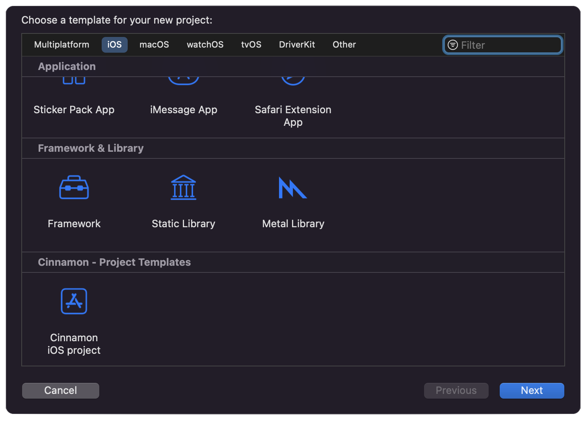

# Cinnamon iOS project Template


## **Table of Contents**

*  [Requirements](#requirements)
*  [Usage](#usage)
    *  [Automatic setup](#automatic-setup)
    *  [Manual setup](#manual-setup)
*  [Screenshots](#screenshots)
*  [Make sure to](#make-sure)

----
## **Requirements** <a name="requirements"></a>
- iOS 15 or later
- Xcode 13 or later.

## **Usage** <a name="usage"></a>
This repository contains an iOS project template used by [Cinnamon Agency](https://cinnamon.agency/) when starting a new project from scratch. <br />
For more info read our [blog](https://cinnamon.agency/blog/post/cinnamon_ios_project_template).

### **Installation** <a name="automatic-setup"></a>
Installation is easy and can be done in seconds! Clone this project, navigate to it's root folder and run:

```bash
make install
```

And you can easily remove it by running:

```bash
make uninstall
```

### **Manual Installation** <a name="manual-setup"></a>
Download the repository and place its contents in:
`~/Library/Developer/Xcode/Templates`

<sup>Note: May ask for admin permissions</sup>

----

## **Screenshots** <a name="screenshots"></a>
Project template should be visible here when creating new project `(Cmd+Shift+N)`:



## **⚠️ Make sure to** <a name="make-sure"></a>
- add [KeychainAccess](https://github.com/kishikawakatsumi/KeychainAccess) and [Cinamofryer](https://github.com/Cinnamon-Agency/Cinamofryer) packages to your project.  
Easiest way to add dependencies is with the Swift Package Manager:
https://developer.apple.com/documentation/xcode/adding-package-dependencies-to-your-app
- install [SwiftLint](https://github.com/realm/SwiftLint) if you want to enforce the style guide rules that are generally accepted by the Swift community
- remove reference for Non-iOS Resource by deleting it.
- delete ContentView file. Replace ContentView with a RootView in @main class.

